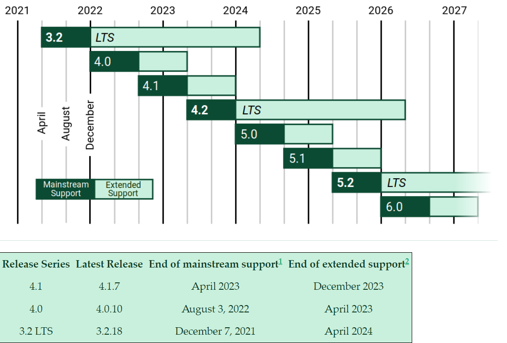
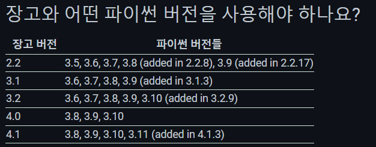

# django

### 초기 설정
1. python 설치 (3.10.10v)
- 23.03.12 기준 3.10의 최신 release 버전

2. django 설치

``` bash
$ python -m venv venv # 가상환경 구축
$ source venv/Script/activate # 가상환경 시작
$ pip install django=3.2.18 # 장고 설치 (pip list로 설치된 라이브러리 확인)
$ pip freeze > requirements.txt # pip로 설치한 라이브러리 덤프
$ django-damin startproject recodeil . # 프로젝트 생성 '.'로 현재 디렉토리에 생성
$ python manage.py startapp recoAlgorithm # 애플리케이션(앱) 생성
```
**django, python LTS버전 및 호환 버전 정보**





## 유의사항
1. 가상환경 시작 시 interpreter 경로 확인
2. **앱 생성 후 프로젝트(recodeil)의 settings.py의 INSTALLED_APPS에 등록**