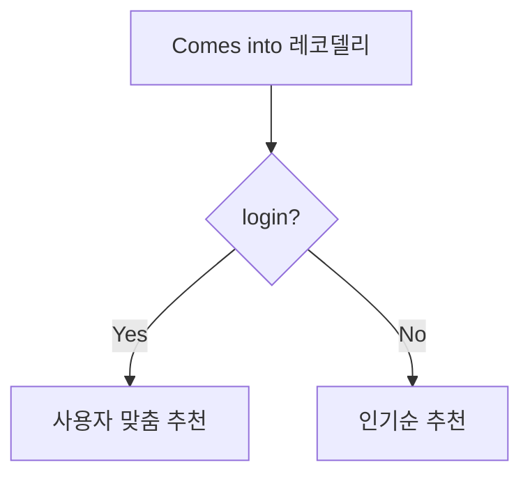

# 2023.03.17 발표

## 목차

1. 서비스 소개
1. 빅데이터 추천
1. 기능 명세
1. ERD
1. 해결해야할 과제 or 부족한 점

## 서비스 소개

저희 서비스 이름은 레코딜리입니다. 뜻은 recommending과 delicious 의 합성어로서 추천맛집을 의미합니다. 서비스의 정체성은 카카오페이지, 네이버 시리즈와 같은 플랫폼들에서 웹툰 웹소설을 가져와 사용자에게 맞춤 컨텐츠를 제공하는 사이트입니다.

## 기획 배경

## 빅데이터 추천

빅데이터 추천에서 활용되는 알고리즘은 KNN 알고리즘.

- 작품 추천 (선호 장르 및 팔로우 기반)
- 유사 성향 사람들과 작품 공유
- 팔로우/팔로잉
  - 선호 장르 팔로우
  - 다른 유저 팔로우 → 팔로우한 유저의 최신 리뷰가 피드에 노출

## 기능 명세

1. 작품 검색
   1. 장르
   2. 조회수
   3. 완결 여부
   4. 작가
   5. 플랫폼
   6. 평점
   7. +..
2. 읽은 작품 기록
   1. 리뷰
3. 즐겨찾기
   1. 작품에 대한 즐겨찾기
   2. 리뷰에 대한 관심
4. 추천
   1. 사용자 취향 설문
   2. 사용자 즐겨찾기
   3. 새로운 장르 추천
   4. -
5. 플랫폼별 무료회차 비교
6. 컬렉션 추천

## ERD

## Diagram

- User

## Note

발표

추천 - 사용자 연령별 추천 / 사용자 즐겨찾기 기반 추천
