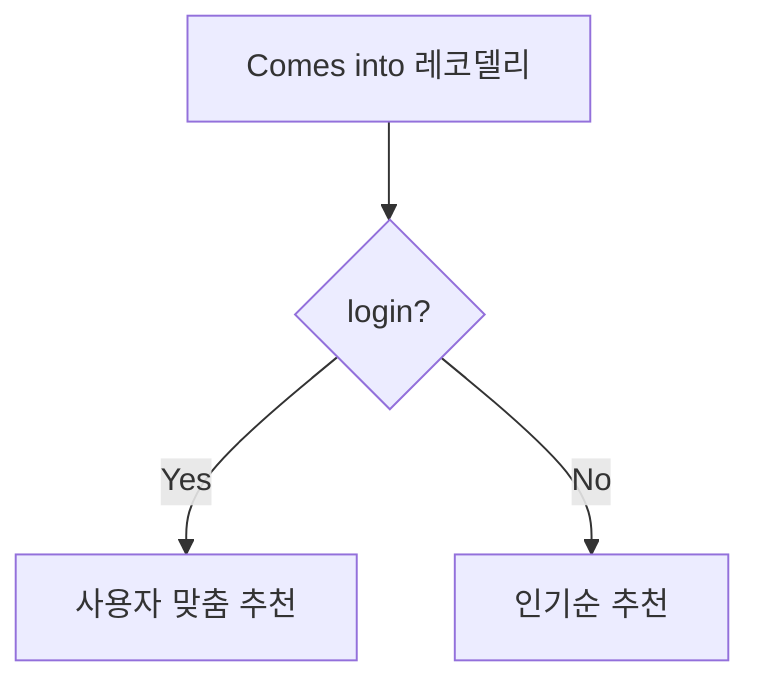

# 2023.03.17 발표

## 목차

1. 서비스 소개
1. 빅데이터 추천
1. 기능 명세
1. ERD
1. 해결해야할 과제 or 부족한 점

## 서비스 소개

저희 서비스 이름은 레코딜리입니다. 뜻은 recommending과 delicious 의 합성어로서 추천맛집을 의미합니다. 서비스의 정체성은 카카오페이지, 네이버 시리즈와 같은 여러 다양한 플랫폼들에서 웹툰 웹소설을 가져와 사용자에게 맞춤 컨텐츠를 제공하는 사이트입니다.

## 기획 배경

대중교통을 이용하다 보면 출근시간, 퇴근시간 등 짧은 이동 시간에 웹툰/웹소설을 즐기는 사람들을 쉽게 볼 수 있습니다. 웹툰과 웹소설의 시장 규모는 2021년 기준 2조 원(각각 1조 5600억 원, 6000억 원)에 달합니다. 그만큼 웹툰과 웹소설을 제공하는 플랫폼도 다양합니다. 소비자들은 매일 새로운 웹툰과 웹소설을 찾지만 너무 많은 플랫폼들과 작품들 사이에서 자신이 좋아할 만한 작품이 어떤 것인지 선별하기 쉽지 않습니다. 저희 프로젝트는 이러한 고민을 저희의 작품 추천 기능과 작품별 총평 리뷰로 해결해 주고자 합니다. 레코딜리의 추천 알고리즘으로 사용자의 취향에 꼭 맞는 웹소설 혹은 웹툰을 추천해주고, 각 작품 전체에 대한 총평 리뷰를 사용자들끼리 공유하여 사용자가 작품을 선택할 때 도움을 얻을 수 있게 하고자 합니다.

## 빅데이터 추천

빅데이터 추천에서 활용되는 알고리즘은 KNN 알고리즘.

- 키워드 및 태그 간 유사도를 기반으로 사용자가 관심있는 혹은 좋아하는 작품과 유사한 작품 추천
- 사용자가 관심있는 장르 기반 추천
- 웹소설과 웹툰의 플랫폼 별 랭킹 제공
- 작품별 총평 리뷰 작성
- 사용자 커스텀 작품 컬렉션
- 유사 성향 사람들과 작품 공유
- 팔로우/팔로잉
  - 선호 장르 팔로우
  - 다른 유저 팔로우 → 팔로우한 유저의 최신 리뷰가 피드에 노출

## 기능 명세

1. 작품 검색
   1. 장르
   2. 조회수
   3. 완결 여부
   4. 작가
   5. 플랫폼
   6. 평점
   7. +..
2. 읽은 작품 기록
   1. 리뷰
3. 즐겨찾기
   1. 작품에 대한 즐겨찾기
   2. 리뷰에 대한 관심
4. 추천
   1. 사용자 취향 설문
   2. 사용자 즐겨찾기
   3. 새로운 장르 추천
   4. -
5. 플랫폼별 무료회차 비교
6. 컬렉션 추천

## ERD

## Diagram

- User

## Note

발표
