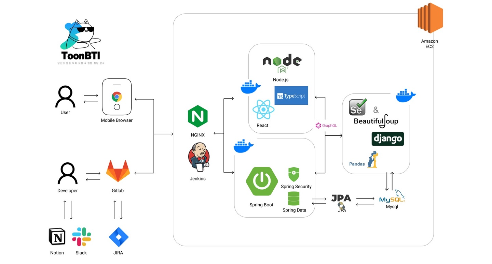

# TOONBTI : 웹툰 취향 분석 테스트

**_지금 TOONBTI으로 👉🏻 https://j8a302.p.ssafy.io/_**

목차

1. 간단 소개

   1. 프로젝트 진행기간
   1. TOONBTI?
   1. 기술 스택 및 Version
   1. 프로젝트 구조도

1. 협업

   1. Ground Rule
   1. 우리는 Git을 이렇게 활용했어요
   1. Notion 활용했어요
   1. Gitlab 활용했어요
   1. 팀원 구성 및 소개

1. 프로젝트
   1. 기획의도
   1. 문제점
   1. 해결
   1. 프로젝트 소개 및 목적
   1. 프로젝트 기술 스택
   1. 주요 기능을 소개합니다!
   1. 프로젝트 시연화면
   1. 공정률
   1. 회고

---

### **💚 프로젝트 진행기간**

<p> 2023/2/17 - 2023/4/7 </p>
<p> SSAFY 8기 특화 프로젝트 </p>

---

### **💛 TOONBTI?**

내가 웹툰 속의 주인공이라면 누구일까? 유형 검사를 통해 웹툰 속의 나를 찾는 서비스!

웹툰 독자 유형 검사를 통해 주인공인 나를 발견하고, 취향에 맞는 웹툰을 추천 받자.

---

### **💚 Ground Rule**

1. 매주 월요일 아침 감사 인사하기
2. 매일 오전/오후 Daily Scrum Meeting 하기 (오늘 할 일, 오늘 한 일 공유)
3. 화내지 않기❌ 짜증내지 않기❌
4. 의견 공유는 오픈 마인드로 받아들이기
5. 니것 내것 나누지 말고 우리는 **팀**이라는 걸 알아주세요😁
6. 팀원을 믿지만 코드는 한 번 더 확인하기 (MR 후 **코드 리뷰**)
7. **재채기하면 Bless you~! 해주기**🤧

---

### **💚 기술 스택 및 Version 📚**

> **Backend** <br>
> development tool : Intellij IDEA 2022.3.2<br>
> spring boot : 2.7.7 <br>
> gradle : 7.6 <br>
> jdk : zulu-11 <br>
> my sql : 8.0.31 <br>
> graphQL <br>
> lombok <br>
> Spring Data JPA <br>
> Spring Security <br>
> Spring Web <br>

> **Frontend** <br>
> development tool : Visual Studio Code <br>
> npm <br>
> node.js : 18.15 <br>
> React 18 <br>
> react-router : v6. <br>
> graphql : 16.6 <br>
> typescript : 4.9 <br>
> styled-components : 5.3 <br>

> **CI/CD** <br>
> AWS EC2 <br>
> Jenkins <br>
> NGINX <br>
> Docker <br>

> **그 외 협업툴 📕** <br>
> Git, source tree - 브랜치 전략을 통해 기능 분리<br>
> Notion - 전체적인 회의 관할 및 모든 메모<br>
> JIRA - 주단위 목표량 설정 및 할일 배분 <br>
> Slack - 빌드 소식 확인용 <br>

---

### **💛 프로젝트 기술 스택**



---

### **💛 프로젝트 구조도 📚**

#### B.E

```
toonbti
  ├── global
  │   ├── config
  ├── resouces
  │   ├── graphql.schema
  ├── domain
  │   ├── controller
  │   ├── model
  │   │   ├── dto
  │   │   ├── entity
  │   │   ├── repository
  └── └── └── service
```

#### F.E

```
toonbti
  ├── public
  │   └── index
  ├── src
  │   ├── assets
  │   ├── components
  │   ├── pages
  │   ├── App
  │   ├── index
  │   ├── types
  │   └── config
  └── package
```

---

### **💚 팀원 구성 및 소개**

- **B.E**

  | 팀원      | 역할                                 | 이메일                  | Github                              |
  | --------- | ------------------------------------ | ----------------------- | ----------------------------------- |
  | 권성은 👑 | 팀장, CI/CD, SpringBoot 설계 및 개발 | sungeun.kweon@gmail.com | abc@github.com                      |
  | 김진호    | Django 설계 및 개발                  | isagkim@gmail.com       | https://github.com/No88888888       |
  | 전주영    | DB 설계 및 관리                      | wjswndud53@gmail.com    | https://github.com/charoon-wjswndud |

- **F.E**

  | 팀원   | 역할                           | 이메일                   | Github                        |
  | ------ | ------------------------------ | ------------------------ | ----------------------------- |
  | 김태원 | F.E 팀장, 프론트 관리 및 개발  | taw4654@gmail.com        | https://github.com/DanKim0213 |
  | 윤지영 | 디자인, 공통 layout 개발 및 QA | diniless7@gmail.com      | https://github.com/yoonjyjy   |
  | 노현정 | React 개발 및 기술 연구        | nohhyunjeong93@gmail.com | https://github.com/isabel-noh |

---

### **기획의도**

나에게 맞는 웹툰 추천

### **문제점**

웹툰 추천 서비스는

- 웹툰을 추천 서비스로 사람들을 묶어놓을 수 없다. (자체 콘텐츠가 없으니)
- 네이버 웹툰 및 카카오 페이지 내에 자체적인 웹툰 추천 서비스가 있다.

### **해결**

TooNBTI 서비스를 생각했다.

- 사용자들을 묶어놓을 포인트 -> 게임성 + 공유
- 자체 웹툰 추천 -> 자체 설문조사를 통해 빅데이터로 나에게 맞는 웹툰 추천

### **프로젝트 소개 및 목적**

1. 웹툰 독자 유형 테스트

- 설문조사 -> 독자 유형
  - Light / Heavy
  - Strong / Weak
  - Romance / Event
  - Alone / Together

2. 웹툰 취향 분석 서비스

- 재밌게 읽은 웹툰 선택 -> 선택된 웹툰 기반 취향 분석 -> 취향에 맞는 웹툰 추천

### **💚 주요 기능을 소개합니다!**

1️⃣ **웹툰 독자 유형 검사**

> 세분화된 16가지 유형 중 자신의 유형을 알 수 있습니다.
>
> 유형별 선호 웹툰을 추천합니다
>
> 사용자 기반 추천 알고리즘으로 데이터 양과 비례해서 질 좋은 추천이 가능합니다

2️⃣ **웹툰 취향 분석 검사**

> 사용자가 읽은 웹툰을 분석해 웹툰을 추천합니다
>
> 웹툰을 선택하면 비슷한 작품들로 리스트 업데이트되어 기억하지 못한 웹툰까지 입력할 수 있습니다
>
> 작가, 작품명으로 키워드 검색이 가능합니다

3️⃣ **공유하기**

> 검사 결과를 카카오톡이나 링크로 공유할 수 있습니다

### **💚 프로젝트 시연화면**

### **💚 공정률**

- 백엔드 기획 API 24 개 중 18개 완료 (75%)
- 프론트엔드 기획 기능 46개 중 32개 완료 (70%)

### **💚 회고**

- 권성은: 도메인 내에서 주제를 정하는 것이 어려워 기획에 시간을 많이 쏟았고, 이로 인해 개발 시간이 부족했다. 또한 팀원의 역량 차이로 작업 분배에 어려움이 있었다. 하지만 팀원들의 꺾이지 않는 마음과 코치님들의 열정적인 도움으로 프로젝트를 성공적으로 완료할 수 있었다.
- 김진호: 팀 의사결정 방식을 재고해 볼 수 있는 좋은 경험이었다. 열정적인 토의가 이루어진다하더라도 소수의 결정권자가 있어야 빠른 프로젝트 진행이 가능하다는 것을 배웠다.
- 전주영: 프로젝트 기간에 절반 가까이 기획을 투자햇고 남은 시간 안에 개발하다 보니 기획 그대로 구현하기 어려웠습니다. 하지만 팀원들과 일심동체 상부상조하여 프로젝트를 끝마칠 수 있었습니다.
- 노현정: 기획의 중요성을 다시 한번 되새길 수 있었다. 서비스의 방향이나 아이디어를 나 자신을 설득할 수 없는데 사용자를 설득하는 것은 불가능할 것이다. 사용자가 왜 이 서비스를 이용할까를 먼저 생각해보아야겠다.
- 윤지영: 빠르고 탄탄한 기획 단계와 꼼꼼한 일정 관리의 중요성을 느낄 수 있었고, 중간중간 남은 일을 계속 체크하며 진행해야 한다는 것을 절실히 깨달았다. 너무 많은 갈아엎기와 무수한 오류 발생으로 진이 빠졌지만 완주했다는 것이 뿌듯하다.
- 김태원: 6주라는 기간에 적합한 프로젝트 규모에 대해 재고할 수 있었고, 우선순위를 정해 개발 일정을 조율하는 경험을 할 수 있었습니다. 매일 아침 스크럼 미팅으로 소통하며 프로젝트를 끝마칠 수 있었습니다.
